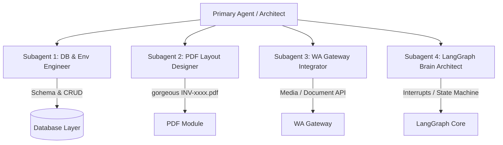

# AGENT INSTRUCTIONS: SYSTEM-WIDE RULES & VIBE CODING GUIDELINES (LANGCHAIN & LANGGRAPH EDITION)

Welcome, AI Agent! You are pair-programming in the **AI-Umroh (WhatsApp Bot)** repository. This project is built using a modern **"Vibe Coding"** philosophy, combining rapid natural-language guidance with robust, production-grade engineering powered by **LangChain** and **LangGraph** (Python).

To maintain speed, structure, and reliability, you **MUST** strictly adhere to the instructions defined in this document.

---

## 1. CORE MISSION: LANGGRAPH-DRIVEN MODULARITY

Never write massive, monolithic files. In LangGraph, logic should be decomposed into pure **nodes**, well-defined **tools**, a structured **state**, and clean **conditional edges**.

### The Rule of 150 (Strict Limit)
* **Max File Length**: No single file should exceed **150-200 lines of code**. If a graph file or tool file grows beyond this, decompose it immediately.
* **Single Responsibility**: One file, one job. Separate State definitions, Node implementations, Tool registrations, Graph construction, and PDF/WhatsApp integrations.

### Standard Directory Structure (LangGraph Optimized)
Your project files must follow this structured Python layout:
```text
ai-umroh/
├── .venv/                  # Isolated virtual environment (always activated)
├── config/                 # YAML or Python settings, environment configurations
├── database/               # SQL scripts, Prisma/SQLAlchemy setups, and migrations
├── ai_umroh/               # All project source code lies here
│   ├── utils/              # Helper utilities
│   │   ├── __init__.py
│   │   ├── pdf_generator.py # PDF invoice layouts and generator services
│   │   └── logger.py       # Custom structured logger
│   ├── graph/              # LangGraph component layers
│   │   ├── __init__.py
│   │   ├── state.py        # Graph state definition (TypedDict/Pydantic)
│   │   ├── tools.py        # LangChain tools for agent interaction
│   │   ├── nodes.py        # Graph nodes (pure functions handling state transitions)
│   │   └── edges.py        # Conditional routers and routing logic
│   ├── __init__.py
│   └── agent.py            # Graph construction, compilation, and checkpointing
├── .env                    # Environment variables (API keys, ports)
├── langgraph.json          # Deployment & CLI configuration for LangGraph
├── requirements.txt        # Flat package dependencies (extremely simple to debug)
├── blueprint_ai_umroh.md    # System interaction blueprints
├── use_case_umroh_ai.md     # Chat simulation and scenarios
└── agent.md                # This rules file
```

---

## 2. PYTHON ENVIRONMENT & DEBUGGING STANDARDS

To maintain absolute environment predictability and frictionless debugging, always adhere to standard virtual environment management:

### A. Dedicated Virtual Environment (`.venv`)
* **Strict Isolation**: A local virtual environment directory named `.venv` **must** be created at the project root. All dependencies must be installed inside this environment. Never use global Python environments.
* **Venv Activation**: Before running any terminal command, testing scripts, or compiling graphs, ensure that the `.venv` is activated:
  * Windows PowerShell: `.\.venv\Scripts\Activate.ps1`
  * Windows CMD: `.\.venv\Scripts\activate.bat`

### B. Dependency Management (`requirements.txt`)
* **Frictionless Setup**: Always use a standard, flat `requirements.txt` file for package management. Avoid complex package managers (such as Poetry or Pipenv) to make debugging fast and direct.
* **Drift Prevention**: Whenever installing a new package via `pip install <package>`, immediately add it to `requirements.txt` with version pinning to avoid environment drift across different sessions.
* **Verify Installation**: If imports fail, immediately check the active environment path (`which python` or `where.exe python`) to ensure it points to the local `.venv`.

---

## 3. 4-SUBAGENT DELEGATION STRATEGY (HIGH-FOCUS DEV)

To ensure rapid, parallel development without context rot or overlapping scopes, tasks are strictly partitioned among **four (4) hyper-focused subagents**. Each agent handles exactly **one** distinct feature layer.



### 🤖 Subagent 1: Environment & Database Engineer
* **Scope**: Feature 1 (Database & Persistence Layer) and environment initialization.
* **Primary Responsibilities**:
  1. Set up the local virtual environment (`.venv`) and the base `requirements.txt` file.
  2. Implement local SQLite configurations using `SQLAlchemy` or `SQLModel`.
  3. Code the `Jemaah` and `Booking` database models.
  4. Write clean repository functions (`get_or_create_jemaah`, `create_booking`, `update_booking_proof`, `verify_payment`).
  5. Provide a standalone database seeding script.

### 🤖 Subagent 2: Premium PDF Invoice Specialist
* **Scope**: Feature 5 (Premium PDF Invoice Generator).
* **Primary Responsibilities**:
  1. Build the standalone `pdf_generator.py` module inside `ai_umroh/utils/`.
  2. Code a highly aesthetic, premium invoice layout using a robust Python PDF library (e.g., `ReportLab`, `fpdf2`, or HTML-to-PDF).
  3. Ensure it dynamically parses details (invoice ID, pilgrim manifest, total bill with unique 3-digit code, PT bank info).
  4. Build a local execution script to test and save dummy PDF invoices for manual verification.

### 🤖 Subagent 3: WhatsApp Gateway Integrator
* **Scope**: Feature 2 (WhatsApp Gateway & Media Routing).
* **Primary Responsibilities**:
  1. Establish WhatsApp connectivity logic (using the specified API wrapper/SDK).
  2. Implement the QR-code pairing hook and stable session persistence.
  3. Code the incoming message parser (routing text to the AI and identifying incoming media files as payment proofs).
  4. Code the document-sender utility to upload generated PDFs and deliver them directly into the WhatsApp thread.

### 🤖 Subagent 4: LangGraph Stateful Brain Architect
* **Scope**: Feature 3 & Feature 6 (LangGraph State, Persona Prompting, and Mute Breakpoint).
* **Primary Responsibilities**:
  1. Establish the graph schema and annotation rules in `state.py`.
  2. Code the Salsa prompt system, including exact guardrails and objection-handling nodes in `nodes.py`.
  3. Build the core transition mapping in `edges.py` and graph compilation in `agent.py`.
  4. **Strict Interrupt Setup**: Configure LangGraph's native checkpointers and **breakpoints** (`interrupt_before=["verify_payment"]`). When `payment_status` changes to `WAITING_VERIFY`, the graph must halt execution, muting the bot to incoming messages.
  5. Provide the API/CLI hooks for human-in-the-loop resumption.

---

## 4. LANGGRAPH DESIGN PRINCIPLES

### A. State Definition (`state.py`)
* Use `TypedDict` or `Pydantic` models for the graph state.
* Maintain a clean messages list using `Annotated[list, add_messages]`.
* Explicitly track sales manifest variables and booking variables within the state:
  ```python
  class UmrohAgentState(TypedDict):
      messages: Annotated[list, add_messages]
      pilgrim_id: str
      whatsapp_number: str
      fullname: str
      domicile: str
      pax_count: int
      payment_status: str       # 'POTENTIAL', 'PENDING_DP', 'WAITING_VERIFY', 'PAID'
      total_bill: float
      unique_code: int
      proof_url: str
  ```

### B. Nodes (`nodes.py`)
* Nodes must be pure functions that take the state as input and return updated keys.
* Keep node functions short (under 50 lines). If a node has to perform database queries or generate PDFs, delegate that logic to helper classes in the repository or utility layer.

### C. Tools (`tools.py`)
* Declare tools using the `@tool` decorator from `langchain_core.tools`.
* **CRITICAL**: Always write highly descriptive docstrings for each tool. The LLM uses these docstrings to decide when and how to call tools.
* Example tools: `calculate_dp_tool`, `generate_pdf_invoice_tool`, `save_pilgrim_manifest_tool`.

### D. Human-in-the-Loop & Muting (`agent.py`)
* **Interrupts for Muting**: The `WAITING_VERIFY` state represents a manual audit stage. 
* Implement this using LangGraph's **interrupts/breakpoints** (e.g., `interrupt_before=["verify_payment"]` or compilation with `compile(checkpointer=..., interrupt_before=[...])`).
* When the bot receives a payment proof, transition `payment_status` to `WAITING_VERIFY`, update the thread checkpoint, and halt graph execution.
* The graph remains **MUTED** (paused) until the travel admin manually approves the transaction via a backend API, which updates the state and resumes the graph using `app.update_state()`.

---

## 5. "VIBE CODING" BEST PRACTICES

### A. Step-by-Step Evolution
1. **Define State & Schema**: Establish the state model first.
2. **Register Tools**: Implement individual tools and test them in isolation.
3. **Draft Nodes**: Build isolated node functions.
4. **Compile Graph**: Assemble the graph structure, conditional edges, and register checkpointing.
5. **Verify Flow**: Test using LangGraph CLI (`langgraph dev`) or local integration tests.

### B. Keep Context Clean
* If the conversation context is growing large or the AI starts getting confused, suggest restarting the session or chunking files.
* Never provide "lazy" code blocks with hidden lines (`# ... rest of code`). Output fully replaceable code blocks.

### C. Error Boundaries & Logging
* Wrap every graph step, tool call, database connection, and WhatsApp API event in structured `try-except` blocks.
* Log all state transitions with trace IDs to ensure easy debugging during long running multi-step agent runs.

---

*Remember: LangGraph is a powerful framework for stateful agents. Let the graph orchestrate the workflow, keep the nodes pure, and always align with the blueprint. Happy vibe coding!*
