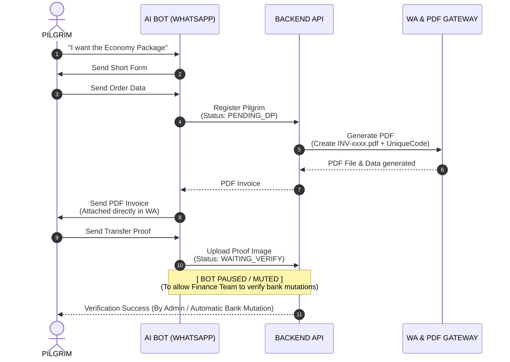

# COMPLETE AI-UMROH SYSTEM FLOW BLUEPRINT (WHATSAPP BOT): SALES & CLOSING MODE

This document describes the system architecture design of AI-Umroh, fully focused on package consultations, manifest data collection, automatic in-chat PDF Invoice generation, and payment success verification.

## 1. System Interaction Diagram (Sequence Diagram)

The system uses a PDF Invoice-First flow where the AI collaborates with an internal PDF generator to immediately present the official invoice file directly to the pilgrim's WhatsApp screen.

---

## 2. Step-by-Step Transaction Flow

### Step 1: Package Consultation & Instant Recommendation
AI detects pilgrim preferences (e.g., budget, number of participants) and provides matching umrah package recommendations within 1-2 friendly paragraphs.

### Step 2: Short Manifest Data Collection (No External Links)
Once the pilgrim is interested, AI directly sends a simple text template so the pilgrim can just copy, paste, and fill in their name, number of participants, and city of origin directly in the WhatsApp chat.

### Step 3: Price Calculation + Automatic Unique Code
The backend system automatically calculates the total Down Payment (DP) using the formula:

$$\text{Total DP} = (\text{DP per Pax} \times \text{Number of Participants}) + \text{Unique Code}$$

* **DP per Pax**: IDR 5,000,000
* **Unique Code**: 3-digit random number (e.g., `412`) to easily detect automatic bank transfers.

### Step 4: Instant PDF Invoice Generation & Delivery
Backend calls a PDF generation library (such as PDFKit or Puppeteer), inputs the pilgrim data, invoice number, unique-code-inclusive amount, and the official PT bank account number. The file is uploaded to cloud storage and sent as a document attachment (PDF document) directly to the pilgrim's WhatsApp.

### Step 5: Transfer Proof Receipt & Temporary Bot Muting (Pause)
After the pilgrim sends a photo of the transfer proof, the AI detects the media file:
1. Saves the image data to the server.
2. Updates the booking status to `WAITING_VERIFY`.
3. Disables the auto-responder AI (Mute/Pause) specifically for that WhatsApp number so the manual bank mutation verification by the travel admin can proceed personally without bot interruption.

---

## 3. Minimum Database Table Structure (Backend Setup)

### Table Jemaah (Pilgrim)
* `id` : String (UUID) - Unique Pilgrim ID
* `whatsapp_number` : String - Pilgrim's WhatsApp Number (Primary Key)
* `nama_lengkap` : String - Full name of the customer
* `domisili` : String - Pilgrim's city of origin
* `status_pembayaran` : Enum (`POTENTIAL`, `PENDING_DP`, `WAITING_VERIFY`, `PAID`)

### Table Booking
* `id` : String - Invoice Number (e.g., `INV-UMROH-1002`)
* `jemaah_id` : String (FK) - Relation to Jemaah table
* `paket_nama` : String - Selected package name (Economy / Premium)
* `jumlah_pax` : Integer - Number of pilgrims
* `total_tagihan` : Decimal - Total bill including unique code
* `kode_unik` : Integer - 3-digit random number (001-999)
* `bukti_transfer_url` : String (Nullable) - File path / URL of the uploaded transfer proof image
